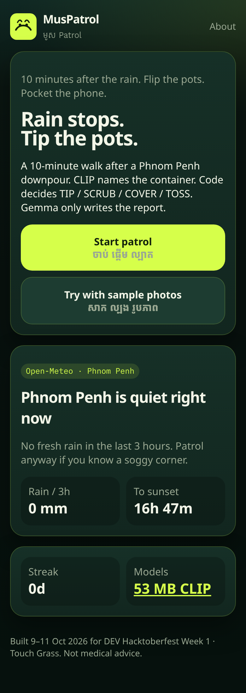
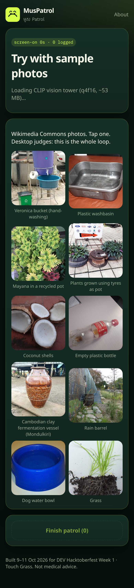
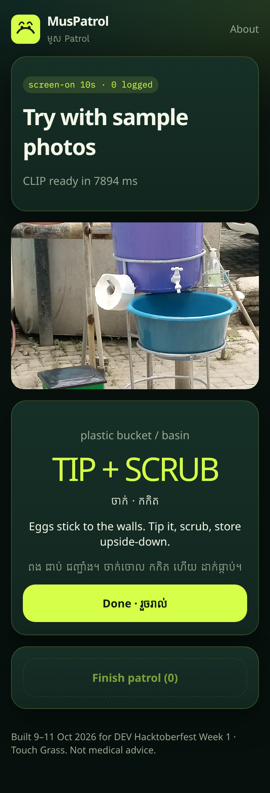
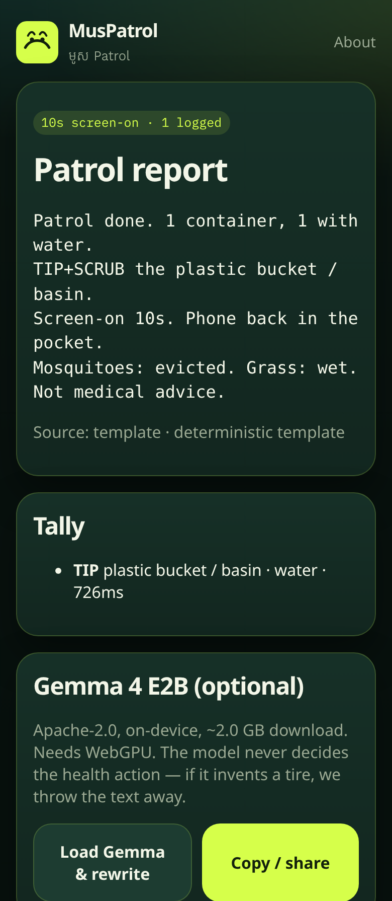

# MusPatrol — មូស Patrol

There is no fall foliage in Phnom Penh. After a downpour, this installable web app sends you outside for a **10-minute patrol** of your yard, balcony, or street. You tip, scrub, cover, or toss the small water-holding things where *Aedes* mosquitoes breed.

Snap a container → **CLIP** in the browser suggests the top 3 types → you confirm and tap “water inside?” → a **TypeScript rules table** prints the order (TIP / SCRUB / COVER / TOSS / CHANGE / REPORT) in English and a short Khmer line → tally. At the end, **Gemma 4 E2B** (on-device, WebGPU) may write a cheeky report. If it invents a tire, we throw the text away and use a template. **The model never decides the health action.**

Built **9–11 Oct 2026** for [DEV Hacktoberfest Open-Source AI Challenge Week 1: Touch Grass](https://dev.to/challenges/hacktoberfest-week1-2026-10-05).

## Live demo

**https://muspatrol.vercel.app** (static build of `main`, deployed on Vercel)

Judges: tap **Try with sample photos**. No camera, no account, ~30 seconds. Photos are Wikimedia Commons (credits on About + `NOTICE.md`).

## Why

Rainy season is dengue season. Guidance is boring and correct: after every rain, empty the saucers, scrub the buckets, lid the ពាង, bin the coconut shells. The screen should be on for the snap and the order, then go away.

Open models matter here because the pictures are of home, storms kill 4G, and a sangkat volunteer should not need an API key.

## How to run

Needs [Bun](https://bun.sh) (or Node 22).

```bash
bun install
bun run embed-labels   # CLIP text embeds → src/ml/label-embeds.json (already committed)
bun run test
bun run dev            # http://localhost:5173
bun run build && bun run preview
```

Static host: `dist/` on Vercel (live: https://muspatrol.vercel.app) or Render. See `vercel.json` and `render.yaml`. No backend.

Optional on a WebGPU laptop: open a finished patrol and tap **Load Gemma & rewrite**. First download is **2,003,697,664 bytes** (HEAD of `gemma-4-E2B-it-web.task`). This repo does not vendor that file.

## Screenshots

| Home | Judge samples | Order card | Report |
|---|---|---|---|
|  |  |  |  |

## What works / what doesn't (this checkout)

Works:

- Home + Open-Meteo patrol window (Phnom Penh default, cached)
- Camera *or* Commons judge-mode photos
- CLIP vision tower, top-3 picker, water toggle, rules table, tally, template report + validator
- PWA app shell, static build
- Unit tests for rules, validator, rain sum

Does not (yet):

- Outdoor field test — see `docs/field-test-log.md`
- Gemma 4 actually loaded on this build VM (no WebGPU). Code path is there; template is the default
- ElevenLabs voice lines
- Render llama.cpp second-look
- Native-speaker Khmer sign-off — `docs/khmer-review.md`

DEV post (final, unpublished copy): [`docs/dev-week1-post.md`](docs/dev-week1-post.md).

Measured numbers (no invented field stats): [`docs/numbers.md`](docs/numbers.md).

Headline from this VM, Node CPU, 10 Commons photos:

- CLIP vision `q4f16`: **53.3 MB** (`HEAD`)
- Sample-set accuracy: **8/10 top-1, 10/10 top-3**, **43 ms** mean
- Gemma 4 web task: **2.00 GB** (`HEAD`) — not run here
- `dist/`: **28.9 MiB** (mostly 25.6 MiB ONNX Runtime WASM)

## Commits after deadline (11 Oct 23:59 PDT)

None yet. If anything lands after Sun 11 Oct 2026, 23:59 PDT (Mon 12 Oct 13:59 ICT), it will be listed here. Required by the challenge rules.

## Credits / licenses

App code: MIT. Models, fonts, weather, and photographs keep their own licenses — [`NOTICE.md`](NOTICE.md).

Judge-mode authors include Gkbediako, Mvolz, Maybeonlyone, Gpkp, Gausanchennai, Echendu Tracy, Turaids, USEPA, Ohiopetwatch, Tobias Geberth. Thank you for releasing the pictures.

Not medical advice. Follow the Ministry of Health / WHO dengue guidance.
